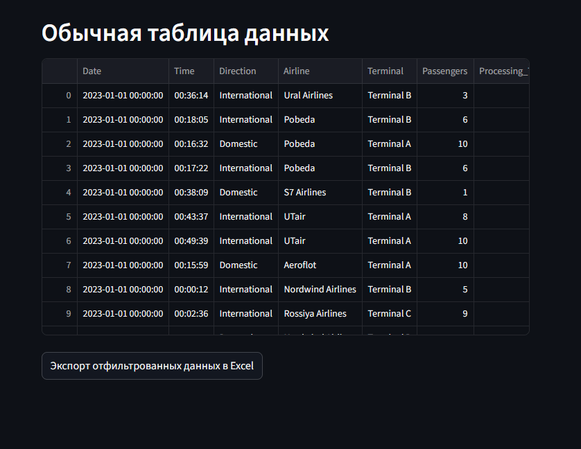
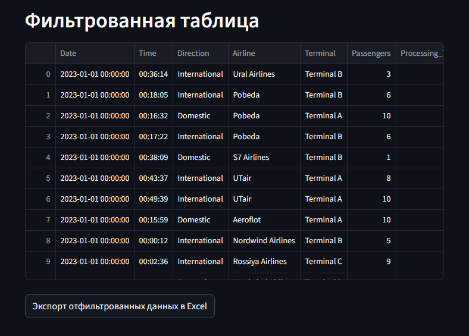
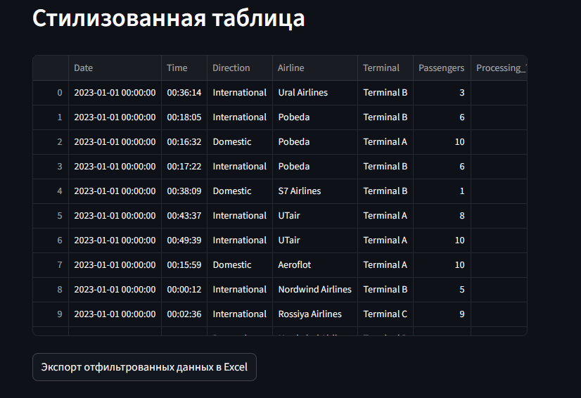
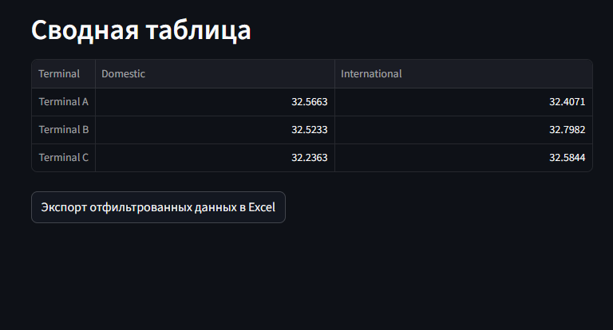
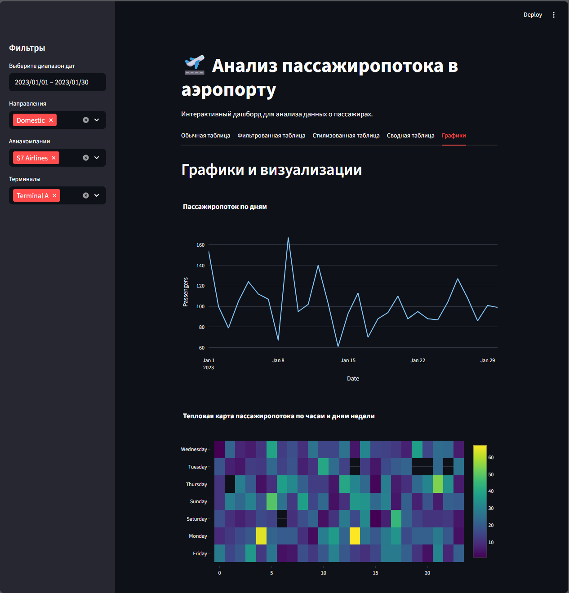

<!-- README.md - English Version -->
<div align="center">

# 🛫 Airport Passenger Flow Analysis
### *Interactive dashboard with tables and charts based on passenger data*

<br>

[](https://python.org)
[](https://streamlit.io)
[](https://pandas.pydata.org)
[](https://plotly.com/python/)
[](https://www.docker.com/)

<br>

<div align="center">
  <a href="https://katiekurenkova.streamlit.app/">
    
  </a>
  &nbsp;&nbsp;
  <a href="https://github.com/yourusername/airport-dashboard/blob/main/README_RU.md">
    
  </a>
</div>

<br>

<p align="center">
  <a href="#project-description">📋 Description</a> •
  <a href="#technologies-used">⚙️ Technologies</a> •
  <a href="#key-features">🔍 Features</a> •
  <a href="#screenshots">🖼️ Screenshots</a> •
  <a href="#how-to-run">🚀 Run</a> •
  <a href="#license">📝 License</a>
</p>

</div>

---

## 📋 Project Description
> **Demonstration of various table and chart variations for airport passenger flow analysis**

This project provides an interactive dashboard for analyzing synthetic airport passenger data. It includes multiple visualization options and filtering capabilities to explore passenger flow patterns, processing times, and airline performance.

**Project includes:**
- ✅ Synthetic passenger data generation (dates, destinations, airlines, terminals, processing times)
- ✅ Streamlit application with five tabs for different data display formats
- ✅ Interactive filters and Excel export functionality
- ✅ Comprehensive visualizations including charts and pivot tables

---

## ⚙️ Technologies Used

<div align="center">

| Component | Library/Tool | Purpose |
|-----------|--------------|---------|
| **Programming Language** |  | Project foundation |
| **Data Generation** |   | Synthetic data creation |
| **Data Processing** |   | Excel read/write, data aggregation |
| **Visualization** |  | Interactive charts and graphs |
| **Interface** |  | Web application with tables and filters |
| **Containerization** |  | Container deployment |

</div>

---

## 🔍 Key Features

### 📊 **Data Generation & Management**
- **Synthetic Data**: Realistic passenger data with 10,000+ records
- **Dynamic Generation**: Script-based data creation with customizable parameters
- **Excel Export**: Save filtered results for external analysis

### 🎨 **Table Variations**
| Table Type | Description | Use Case |
|------------|-------------|----------|
| **Default Table** | Raw data display | Quick data inspection |
| **Filtered Table** | Interactive filtering | Focused data analysis |
| **Styled Table** | CSS-enhanced formatting | Presentation-ready views |
| **Pivot Table** | Aggregated statistics | Summary analysis |

### 📈 **Visualizations**
- **Line Charts**: Passenger flow trends over time
- **Heatmaps**: Passenger density by hour and day
- **Histograms**: Distribution analysis by airline
- **Bar Charts**: Comparative analysis of terminals

### ⚡ **Interactive Features**
- **Real-time Filtering**: Instant data filtering by multiple criteria
- **Theme Toggle**: Light/dark mode support
- **Responsive Design**: Works on different screen sizes
- **Export Options**: Data export in Excel format

---

## 🖼️ Screenshots

<div align="center">

### 📱 Dashboard Overview

*Main dashboard interface with navigation tabs*

### 📊 Data Tables
<table>
<tr>
<td></td>
<td></td>
</tr>
<tr>
<td align="center"><i>Regular data table</i></td>
<td align="center"><i>Filtered table view</i></td>
</tr>
</table>

<table>
<tr>
<td></td>
<td></td>
</tr>
<tr>
<td align="center"><i>Styled table with CSS</i></td>
<td align="center"><i>Pivot table analysis</i></td>
</tr>
</table>

### 📈 Charts & Visualizations

*Interactive charts: line, heatmap, and histogram*

</div>

---

## 🚀 How to Run

### 📦 Local Installation

#### 1. Clone Repository
```bash
git clone https://github.com/yourusername/airport-dashboard.git
cd airport-dashboard