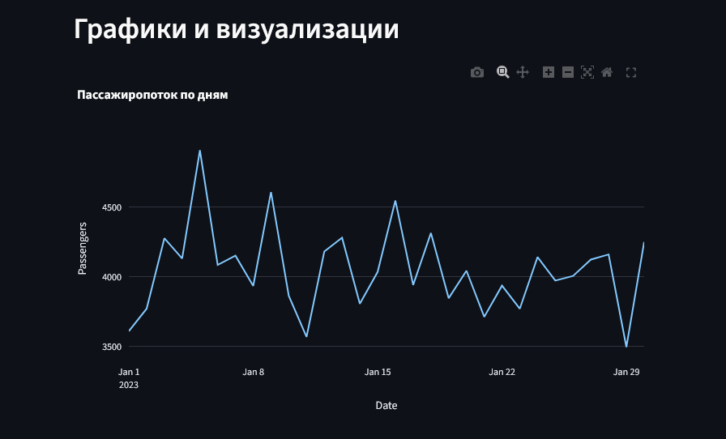

<!-- README.md -->
<div align="center" id="top">
<div id="language-selector" style="position: absolute; top: 20px; right: 20px; background: white; padding: 5px 10px; border-radius: 15px; box-shadow: 0 2px 5px rgba(0,0,0,0.1); z-index: 1000;">
  <a href="#" onclick="setLanguage('ru'); return false;" style="margin-right: 10px; text-decoration: none; color: #333; font-weight: 500;">🇷🇺 Русский</a> | 
  <a href="#" onclick="setLanguage('en'); return false;" style="text-decoration: none; color: #333; font-weight: 500;">🇬🇧 English</a>
</div>

<script>
function setLanguage(lang) {
  // Скрываем все языковые блоки
  document.querySelectorAll('[id$="-content"]').forEach(el => {
    el.style.display = 'none';
  });
  // Показываем выбранный языковой блок
  const target = document.getElementById(lang + '-content');
  if (target) target.style.display = 'block';
  // Сохраняем выбор в localStorage
  if (typeof(Storage) !== 'undefined') {
    localStorage.setItem('preferredLanguage', lang);
  }
  // Прокручиваем страницу вверх
  window.scrollTo(0, 0);
}

// При загрузке страницы проверяем сохраненный язык
document.addEventListener('DOMContentLoaded', function() {
  const userLang = localStorage.getItem('preferredLanguage') || 
                  (navigator.language.startsWith('ru') ? 'ru' : 'en');
  setLanguage(userLang);
});
</script>

<div id="ru-content" style="display: none;">
# 🛫 Анализ пассажиропотока в аэропорту
### <i>Интерактивный дашборд с таблицами и графиками на основе данных о пассажирах</i>

<br>

[](https://python.org)
[](https://streamlit.io)
[](https://pandas.pydata.org)
[](https://plotly.com/python/)
[](https://www.docker.com/)

<br>

<div align="center">
  <a href="https://katiekurenkova.streamlit.app/">
    
  </a>
</div>

<br>

<p align="center">
  <a href="#описание-проекта">📋 Описание</a> •
  <a href="#используемые-технологии">⚙️ Технологии</a> •
  <a href="#ключевые-возможности">🔍 Возможности</a> •
  <a href="#как-запустить">🚀 Запуск</a>
</p>

</div>

---

## 📋 Описание проекта
> <b>Демонстрация различных вариаций таблиц и графиков для анализа пассажиропотока в аэропорту</b>

Проект включает:
- Генерацию синтетических данных о пассажирах (даты, направления, авиакомпании, терминалы, время обработки)
- Streamlit-приложение с пятью вкладками для отображения данных в разных форматах
- Интерактивные фильтры и экспорт в Excel

---

## ⚙️ Используемые технологии

| Компонент | Библиотека/инструмент | Назначение |
|----------|------------------------|------------|
| <b>Язык программирования</b> | <code>Python 3.9+</code> | Основа проекта |
| <b>Генерация данных</b> | <code>pandas</code>, <code>numpy</code> | Создание синтетических данных |
| <b>Обработка данных</b> | <code>pandas</code>, <code>openpyxl</code> | Чтение/запись Excel, агрегация |
| <b>Визуализация</b> | <code>plotly.express</code>, <code>plotly.graph_objects</code> | Интерактивные графики |
| <b>Интерфейс</b> | <code>streamlit</code> | Веб-приложение с таблицами и фильтрами |
| <b>Контейнеризация</b> | <code>docker</code> | Создание контейнера для приложения |

---

## 🔍 Ключевые возможности

✅ **Генерация данных**: Скрипт `generate_data.py` создает XLSX-файл с примерами данных
✅ **Вариации таблиц**:
   - Обычная таблица данных
   - Фильтрованная таблица с динамическими фильтрами
   - Стилизованная таблица с CSS
   - Сводная таблица (pivot table)
✅ **Графики и визуализации**:
   - Линейный график пассажиропотока по дням
   - Тепловая карта по часам и дням недели
   - Гистограмма по авиакомпаниям
✅ **Настройки интерфейса**:
   - Переключатель темы (светлая/темная)
   - Фон с изображением самолета (assets/AirPlane.png)
✅ **Экспорт**: Кнопка для сохранения отфильтрованных данных в Excel

<br>

<div align="center">
  
  <p><i>Главная страница с вкладками и фильтрами</i></p>
</div>

<div align="center">
  
  <p><i>Вкладка с графиками: линейный график, тепловая карта, гистограмма</i></p>
</div>

<div align="center">
  
  <p><i>Обычная таблица с данными о пассажирах</i></p>
</div>

<div align="center">
  
  <p><i>Фильтрованная таблица с примененными фильтрами</i></p>
</div>

<div align="center">
  
  <p><i>Стилизованная таблица с CSS-оформлением</i></p>
</div>

<div align="center">
  
  <p><i>Сводная таблица со средним временем обработки</i></p>
</div>

<div align="center">
  
  <p><i>Вкладка с графиками: линейный график, тепловая карта, гистограмма</i></p>
</div>
> 📌 *Добавьте скриншоты в папку `assets/` для демонстрации.*

---

## 🚀 Как запустить

### Локальная установка

#### Установка зависимостей
```bash
pip install -r requirements.txt
```

#### Генерация данных
```bash
python generate_data.py
```

#### Запуск приложения
```bash
streamlit run app.py
```

### Запуск в Docker

#### Сборка образа
```bash
docker build -t airport-dashboard .
```

#### Запуск контейнера
```bash
docker run -p 8501:8501 airport-dashboard
```

Приложение будет доступно по адресу: [http://localhost:8501](http://localhost:8501)

### Docker Compose (рекомендуемый способ)

```bash
docker-compose up --build
```

Этот способ автоматически соберет образ и запустит контейнер с правильными настройками.

---

## 📝 Лицензия
[](https://streamlit.io)
[](https://pandas.pydata.org)
[](https://plotly.com/python/)
[](https://www.docker.com/)

<br>

<div id="en-content" style="display: none;">
# 🛫 Airport Passenger Flow Analysis
### <i>Interactive dashboard with tables and charts based on passenger data</i>

<br>

[](https://python.org)
[](https://streamlit.io)
[](https://pandas.pydata.org)
[](https://plotly.com/python/)
[](https://www.docker.com/)

<br>

<div align="center">
  <a href="https://katiekurenkova.streamlit.app/">
    
  </a>
</div>

<br>

<p align="center">
  <a href="#project-description">📋 Description</a> •
  <a href="#technologies-used">⚙️ Technologies</a> •
  <a href="#key-features">🔍 Features</a> •
  <a href="#how-to-run">🚀 Run</a>
</p>

## 📋 Project Description
> <b>Demonstration of various table and chart variations for airport passenger flow analysis</b>

Project includes:
- Synthetic passenger data generation (dates, destinations, airlines, terminals, processing times)
- Streamlit application with five tabs for different data display formats
- Interactive filters and Excel export

## ⚙️ Technologies Used

| Component | Library/Tool | Purpose |
|-----------|--------------|---------|
|----------|--------------|---------|
| <b>Programming Language</b> | <code>Python 3.9+</code> | Project foundation |
| <b>Data Generation</b> | <code>pandas</code>, <code>numpy</code> | Synthetic data creation |
| <b>Data Processing</b> | <code>pandas</code>, <code>openpyxl</code> | Excel read/write, data aggregation |
| <b>Visualization</b> | <code>plotly.express</code>, <code>plotly.graph_objects</code> | Interactive charts |
| <b>Interface</b> | <code>streamlit</code> | Web application with tables and filters |
| <b>Containerization</b> | <code>docker</code> | Creating a container for the application |

---

## 🚀 How to Run

### Local Installation

#### Install Dependencies
```bash
pip install -r requirements.txt
```

#### Generate Data
```bash
python generate_data.py
```

#### Run the Application
```bash
streamlit run app.py
```

### Docker Setup

#### Build the Image
```bash
docker build -t airport-dashboard .
```

#### Run the Container
```bash
docker run -p 8501:8501 airport-dashboard
```

The application will be available at: [http://localhost:8501](http://localhost:8501)

### Docker Compose (Recommended)

```bash
docker-compose up --build
```

This will automatically build the image and run the container with the correct settings.

## 📝 License

This project is licensed under the [MIT](LICENSE) license.

</div>
</div>

<script>
function setLanguage(lang) {
  if (lang === 'ru') {
    document.getElementById('ru-content').style.display = 'block';
    document.getElementById('en-content').style.display = 'none';
    localStorage.setItem('preferredLanguage', 'ru');
  } else {
    document.getElementById('ru-content').style.display = 'none';
    document.getElementById('en-content').style.display = 'block';
    localStorage.setItem('preferredLanguage', 'en');
  }
  window.scrollTo(0, 0);
}

// Check for saved language preference or use browser language
const userLang = localStorage.getItem('preferredLanguage') || 
                 (navigator.language.startsWith('ru') ? 'ru' : 'en');
setLanguage(userLang);
</script>

<style>
#language-selector {
  position: absolute;
  top: 20px;
  right: 20px;
  background: white;
  padding: 5px 10px;
  border-radius: 15px;
  box-shadow: 0 2px 5px rgba(0,0,0,0.1);
  z-index: 1000;
}

#language-selector a {
  text-decoration: none;
  color: #333;
  font-weight: 500;
}

#language-selector a:hover {
  color: #FF4B4B;
}
</style>
